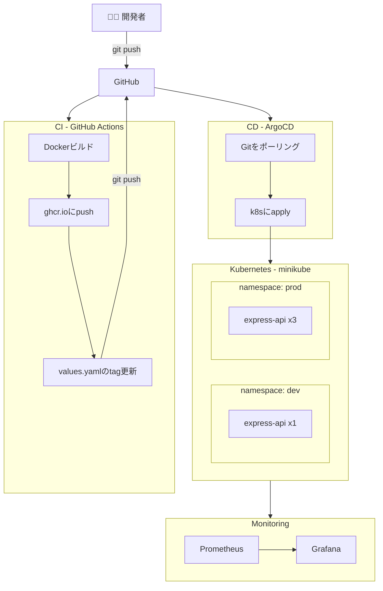

# Platform Engineering Portfolio

## 概要

このリポジトリは、Platform EngineeringのベストプラクティスをミニマムなIDP（Internal Developer Platform）として実装したものです。
開発者がセルフサービスでアプリケーションをデプロイできる基盤を構築しています。

## アーキテクチャ



## 技術スタック

| カテゴリ | 技術 | 用途 |
|---|---|---|
| コンテナ | Docker | アプリケーションのコンテナ化 |
| オーケストレーション | Kubernetes（minikube） | コンテナ管理・スケーリング |
| パッケージ管理 | Helm | K8sリソースのテンプレート化 |
| CI | GitHub Actions | ビルド・イメージpush・tag更新 |
| CD | ArgoCD | GitOpsによる自動デプロイ |
| モニタリング | Prometheus + Grafana | メトリクス収集・可視化 |
| レジストリ | ghcr.io | Dockerイメージの保管 |

## デプロイフロー

```
1. 開発者がコードをmainブランチにpush
2. GitHub ActionsがDockerイメージをビルドしghcr.ioにpush
3. GitHub ActionsがHelmのvalues.yamlのimage.tagを自動更新してgit push
4. ArgoCDがGitの変更を検知（ポーリング）
5. ArgoCDがHelmチャートを解釈してk8sにapply
6. dev/prodそれぞれのnamespaceに新しいイメージでPodが起動
```

## 環境構成

```
dev環境
  namespace: dev
  replicas: 1
  imagePullPolicy: Always

prod環境
  namespace: prod
  replicas: 3
  imagePullPolicy: IfNotPresent
```

## ディレクトリ構成

```
platform-engineering/
├── projects/
│   ├── docker-express-api/   # サンプルアプリ（Node.js）
│   ├── express-api-chart/    # Helmチャート
│   │   ├── values.yaml       # 共通設定
│   │   ├── values-dev.yaml   # dev環境設定
│   │   └── values-prod.yaml  # prod環境設定
│   ├── argocd/               # ArgoCDマニフェスト
│   │   ├── application-dev.yaml
│   │   └── application-prod.yaml
│   ├── k8s-manifests/        # K8sマニフェスト
│   └── cicd/                 # CI/CD関連
├── docs/
│   └── learning-logs/        # 学習ログ
└── README.md
```

## 設計思想

### GitをSingle Source of Truthとする
ArgoCDを採用しPull型のデプロイを実現。インフラの状態は常にGitに記録され、手動変更はArgoCDによって自動的に元に戻されます。

### 環境ごとの設定分離
Helmのvaluesファイルを環境別に分割。共通設定はvalues.yamlに、差分だけをvalues-dev/prod.yamlに記述することで重複を排除しています。

### CI/CDの責務分離
GitHub ActionsはCI（ビルド・テスト・イメージpush）のみを担当し、CDはArgoCDに委譲。それぞれの責務を明確に分離しています。
